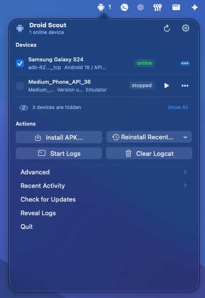
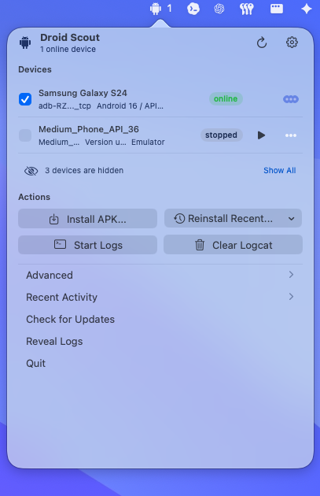
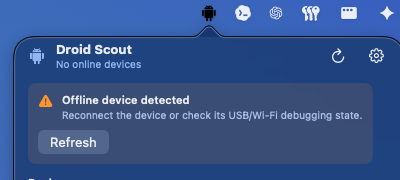
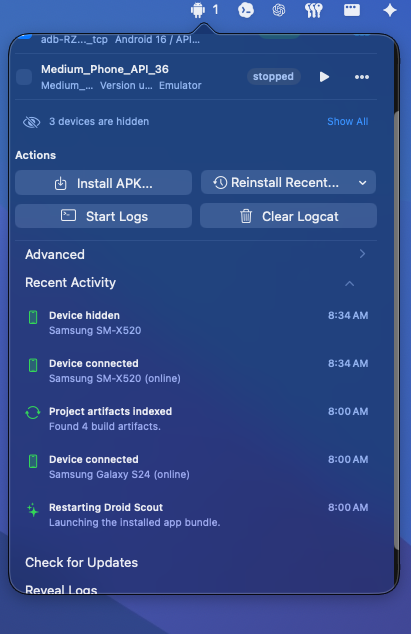
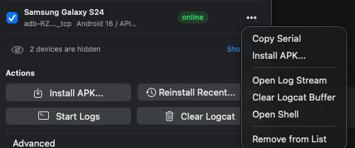
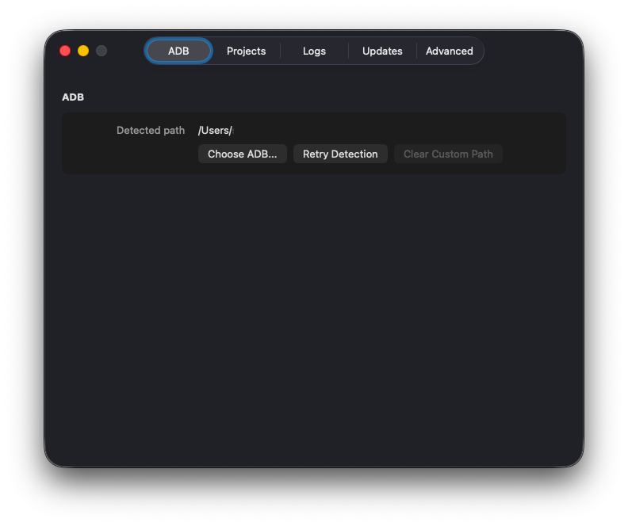
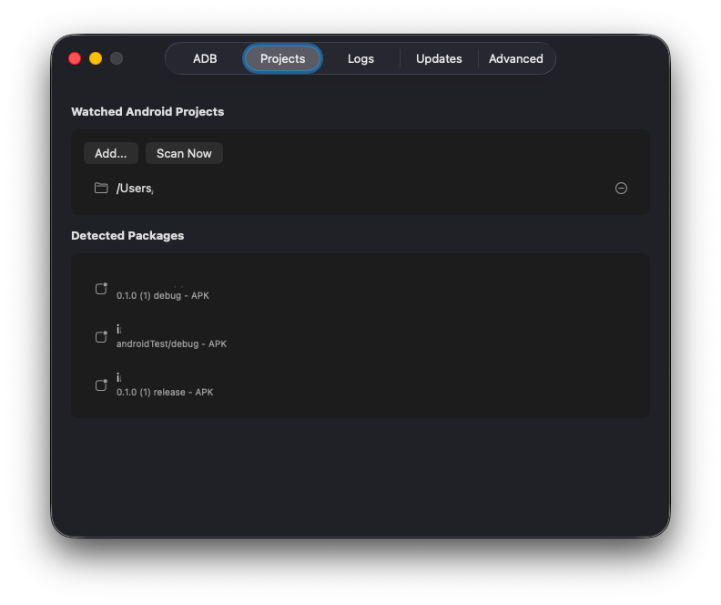
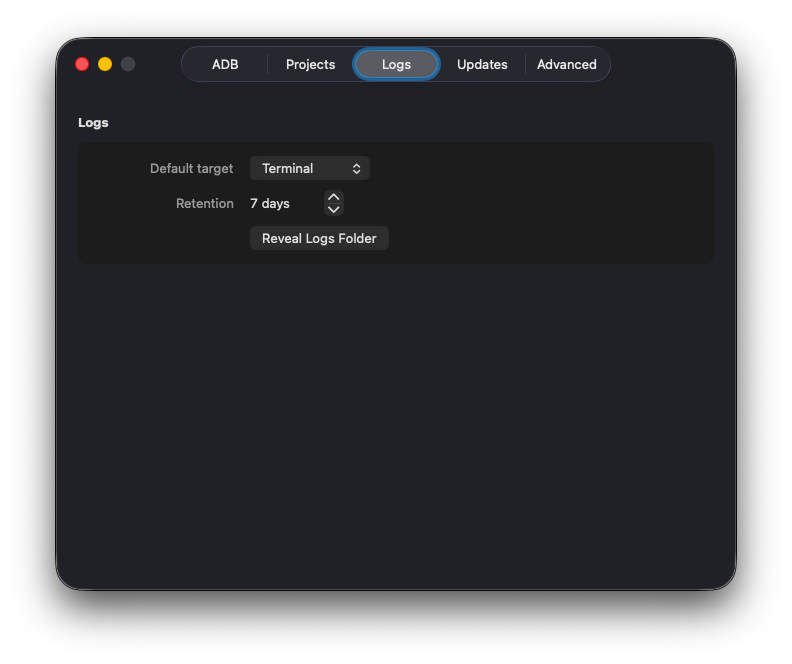
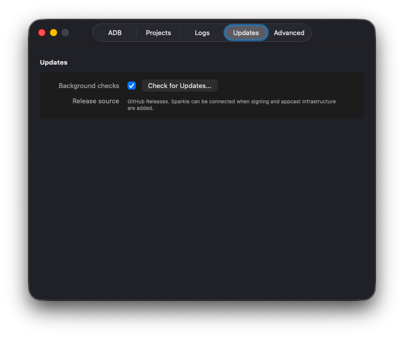
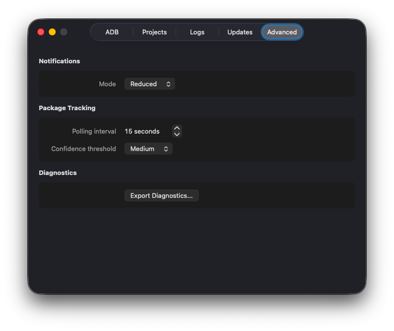

# Droid Scout - Android devices, in your menu bar.

> Native macOS utility for Android developers who keep opening Terminal for the same `adb` chores.

<p align="center">
  
  
  
  
  
  <a href="LICENSE"></a>
</p>

<p align="center">
  
</p>

Droid Scout keeps the everyday Android device loop close to your cursor:

- See connected phones, tablets, and emulators from the macOS menu bar.
- Install or reinstall APKs across selected devices with per-device feedback.
- Reuse recent Gradle build outputs without digging through `build/outputs`.
- Start logcat streams into local files and open them in your preferred tool.
- Detect external Android Studio or Gradle deploys for watched projects.

It uses your installed Android Platform Tools. No bundled ADB, no account, no telemetry.

## Install

### Homebrew Cask

The public cask is the intended install path for launch:

```sh
brew install --cask droid-scout
```

Upgrade with:

```sh
brew upgrade --cask droid-scout
```

Until the first public cask is published, build from source with the steps below.

Maintainers can prepare the release zip, checksum, and cask file with the
[Homebrew cask release guide](docs/homebrew-cask.md).

### ADB

Droid Scout does not bundle ADB. Install Android Platform Tools if `adb` is not already available:

```sh
brew install android-platform-tools
```

ADB discovery order:

1. Custom path selected in Droid Scout settings
2. `$ANDROID_HOME/platform-tools/adb`
3. `$ANDROID_SDK_ROOT/platform-tools/adb`
4. Common macOS Android SDK locations
5. `PATH`, including Homebrew locations

## Screenshots

These are screen captures from the installed macOS app. They are not hand-drawn mockups.

### Command center, dark theme

The main menu-bar popover shows online devices, stopped emulators, hidden devices, and the core device workflow in one place. Device rows include friendly names, shortened serial hints, Android version/API, transport, and scoped actions.

Global actions handle APK install, recent reinstall, logcat streaming, and logcat buffer clearing for the selected devices.

<p align="center">
  
</p>

---

### Command center, light theme

The command center follows the active macOS appearance. The light theme keeps the same device selection, hidden-device disclosure, install, reinstall, logcat, update, logs, and quit actions.

<p align="center">
  
</p>

---

### Offline device state

When no device is online, the menu-bar icon changes color and the popover opens with an offline-device warning. The warning points developers toward reconnecting the device or checking USB/Wi-Fi debugging before retrying.

<p align="center">
  
</p>

---

### Recent activity and hidden devices

The popover records recent device and project events, including device hidden, device connected, project artifacts indexed, and app restart entries. The hidden-device summary keeps ignored devices out of the main list while still making them discoverable.

<p align="center">
  
</p>

---

### Device context menu

Each device has a scoped context menu for serial copying, targeted APK install, opening its log stream, clearing its logcat buffer, opening a shell, or removing the device from the visible list.

<p align="center">
  
</p>

---

### ADB settings

The ADB tab shows the detected platform-tools path and provides controls for choosing a custom `adb`, retrying detection, or clearing a custom path when one is active.

<p align="center">
  
</p>

---

### Projects settings

The Projects tab manages watched Android project folders and surfaces detected packages from Gradle outputs, including debug, androidTest, and release artifacts.

<p align="center">
  
</p>

---

### Logs settings

The Logs tab controls where log streams open, how long local log files are retained, and provides a shortcut to reveal the logs folder.

<p align="center">
  
</p>

---

### Updates settings

The Updates tab keeps update checks explicit and native, with a background-check toggle, manual check button, and release-source note for GitHub Releases.

<p align="center">
  
</p>

---

### Advanced settings

The Advanced tab groups notification volume, package tracking cadence, deploy confidence threshold, and diagnostics export into a compact native settings surface.

<p align="center">
  
</p>

## Why

- **Stop polling `adb devices` by hand.** The status item reflects connected devices and attention states without opening a terminal.
- **Know which target is which.** Rows surface friendly names, shortened serials, Android versions, API levels, and USB/Wi-Fi hints.
- **Redeploy the thing you just built.** Recent artifacts and external deploy detection make rebuild/reinstall loops faster.
- **Keep logs outside the app.** Droid Scout writes logcat streams under `~/Library/Logs/Droid Scout/` and opens them in Terminal, VS Code, Zed, or the default app.
- **Stay native.** Swift, SwiftUI, and AppKit. No Electron.

## Features

- Native macOS menu-bar popover.
- ADB discovery from settings, Android SDK environment variables, common SDK paths, and `PATH`.
- App-owned `adb track-devices` watcher plus periodic snapshots.
- Android emulator discovery with a start action for stopped AVDs.
- Single APK and split APK install to one or more selected online devices.
- Recent APK history for quick reinstall workflows.
- Gradle APK/AAB output indexing for watched Android projects.
- External deploy correlation with confidence levels.
- Logcat stream management with local log files.
- Notification modes: Full, Reduced, and Off.
- Local JSON persistence for settings, watched projects, recent activity, artifacts, and cached display names.

## First Run

1. Launch Droid Scout.
2. Open the menu-bar icon near the system clock.
3. If ADB is missing, install Android Platform Tools or choose a custom `adb` path in settings.
4. Connect an Android device and accept the device authorization prompt.
5. Add Android project folders if you want Gradle artifact indexing and external deploy detection.
6. Install APKs, reinstall recent artifacts, start logs, or open a device shell from the popover.

## Privacy

Droid Scout keeps its data on your Mac.

- App state: `~/Library/Application Support/Droid Scout/`
- Logcat output: `~/Library/Logs/Droid Scout/`
- Diagnostics exports: generated only when requested

Droid Scout does not collect telemetry, require an account, sync data to a cloud service, or bundle crash reporting. Diagnostics exports redact device serials by default.

Network access is only used for explicit update checks or future release update infrastructure.

## Build From Source

Requirements:

- macOS 13 or newer
- Xcode command line tools
- Swift 6 toolchain
- Android Platform Tools for real-device workflows

Build the Swift package:

```sh
swift build
```

Create a release app bundle:

```sh
scripts/build-app.sh release
```

The bundle is written to:

```text
.build/release/Droid Scout.app
```

Install the local build into `/Applications`:

```sh
cp -R ".build/release/Droid Scout.app" "/Applications/Droid Scout.app"
```

Create the Homebrew cask release zip and checksum:

```sh
scripts/package-cask-release.sh release
```

Run directly during development:

```sh
swift run DroidScout
```

Droid Scout is an accessory menu-bar app, so it appears near the system clock instead of opening a main window.

## Testing

Run the deterministic test and coverage gate:

```sh
scripts/test-coverage.sh
```

Run the merged raw SwiftPM coverage report:

```sh
scripts/test-swiftpm-raw-coverage.sh
```

Run the opt-in real-device integration suite:

```sh
scripts/test-real-device-coverage.sh <device-serial>
```

The real-device suite requires one online, authorized physical Android device. See [docs/testing-coverage.md](docs/testing-coverage.md) for details.

## Project Structure

```text
Sources/DroidScout/       Core model, ADB services, project indexing, persistence, and SwiftUI views
Sources/DroidScoutApp/    macOS app entry point, status item, and system action wiring
Tests/DroidScoutTests/    Unit, integration, UI rendering, and opt-in real-device tests
packaging/                App bundle metadata and resources
scripts/                  Build and coverage scripts
docs/                     Product spec, testing notes, and README assets
```

## Release Status

GitHub Releases are intended to be the source of truth for public binaries. The Homebrew cask should install the signed and notarized app archive from the matching release.

The repository currently includes app bundle metadata and an update settings surface. Signing identities, notarization automation, a Sparkle appcast, and the public Homebrew cask are still to be added before a polished public launch.

## Contributing

Issues and pull requests are welcome. For larger changes, open an issue first so the scope can stay aligned with Droid Scout's goal: a focused macOS device/session utility for Android developers.

Please run relevant tests before opening a pull request. Changes touching ADB parsing, project indexing, persistence, or deploy correlation should include focused tests.

## License

Droid Scout is licensed under the [Apache License 2.0](LICENSE).
